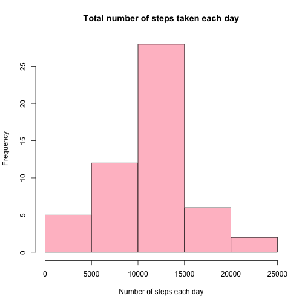

# Reproducible Research: Peer Assessment 1
==========================================

## Loading and preprocessing the data


```r
#Read the "activity.csv" file, from the "activity.zip" file, which I unzipped and placed in the same directory as the Rmarkdown file. By the way, this folder is also my working directory, which is previously set.

data <- read.csv("activity.csv", header = TRUE, sep = ",", na.strings="NA",
                 colClass=c("numeric","Date","numeric"))
```

## What is mean total number of steps taken per day?

1. Make a histogram of the total number of steps taken each day (ignore the missing values)
2. Calculate and report the mean and median total number of steps taken per day


```r
#Create a new dataset without the missing values
dataclean = data[!is.na(data$steps), ]
#Aggregate this new dataset by sum of steps on each day
sumStep = aggregate(steps~date, dataclean, sum)
#Plot the number of steps
hist(sumStep$steps, col ="pink", main="Total number of steps taken each day", xlab="Number of steps each day")
```

 

```r
#Calculate the mean and reporte the value
mean = mean(sumStep$steps)
mean
```

```
## [1] 10766
```

```r
#Calculate the median and reporte the value
median = median(sumStep$steps)
median
```

```
## [1] 10765
```

## What is the average daily activity pattern?
* Make a time series plot (i.e. type = "l") of the 5-minute interval (x-axis) and the average number of steps taken, averaged across all days (y-axis)


```r
#Aggregate the dataset without the missing values by mean of steps for each interval
meanStep = aggregate(steps~interval, dataclean, FUN="mean")
#Plot the intervals on the x-axis and the averaged steps on the y-axis
plot(meanStep$interval, meanStep$steps, type = "l", col = "pink",
     main = "Average number of steps on each interval",
     xlab = "5-minutes intervals",
     ylab = "averaged steps")
```

 

* Which 5-minute interval, on average across all the days in the dataset, contains the maximum number of steps?


```r
max.steps <- meanStep[which.max(meanStep$steps),1]
max.steps
```

```
## [1] 835
```


## Imputing missing values

* Calculate and report the total number of missing values in the dataset (i.e. the total number of rows with NAs)

```r
missingValues <- nrow(data[is.na(data$steps), ])
missingValues
```

```
## [1] 2304
```

* Devise a strategy for filling in all of the missing values in the dataset and create a new dataset that is equal to the original dataset but with the missing data filled in.


```r
# As you remember, there are the "steps" variables that are missing, not the interval variables. I don't know if it's a good strategy but i've chosen to fill the missing values with the mean of the intervals'days on which the steps are missing.
datafull <- data
for (i in 1:nrow(datafull)) {
        if (is.na(datafull$steps[i])) {
                datafull$steps[i] <- mean(data$interval)
        }
}
```

* Report the mean and median total number of steps taken per day


```r
#Aggregate this new dataset by sum of steps on each day
sumStepfull = aggregate(steps~date, datafull, sum)
#Calculate the mean and reporte the value
mean = mean(sumStepfull$steps)
mean
```

```
## [1] 53829
```

```r
#Calculate the median and reporte the value
median = median(sumStepfull$steps)
median
```

```
## [1] 11458
```

Wooow, maybe it's not a good strategy to fill the missing value the mean of the intervals'days on which the steps are missing. As you can see, the mean and the median are much more high than with the previous "dataset" without the missing values.

## Are there differences in activity patterns between weekdays and weekends?
* Create a new factor variable in the dataset with two levels – "weekday" and "weekend" indicating whether a given date is a weekday or weekend day.


```r
# Set the local system time.
Sys.setlocale(category = "LC_ALL", locale = "C")
```

```
## [1] "C/C/C/C/C/fr_CH.UTF-8"
```

```r
datafull$weektime <- as.factor(ifelse(weekdays(datafull$date) %in% c("Saturday","Sunday"),"weekend", "weekday"))
```
* Make a panel plot containing a time series plot (i.e. type = "l") of the 5-minute interval (x-axis) and the average number of steps taken, averaged across all weekday days or weekend days (y-axis).


```r
#Aggregate the dataset by mean of steps for each interval
meanStep2 = aggregate(datafull$steps, by=list(datafull$interval, datafull$weektime), 
                      FUN="mean")
names(meanStep2) <- c("interval", "weektime", "steps")
#Make the plot
library(lattice)
xyplot(meanStep2[, 3]~meanStep2[, 1]|meanStep2[, 2], 
   type="l", col ="pink", ylab="Number of steps", xlab="Interval", layout = c(1,2))
```

 

On week-ends, there are more variation. On the weekdays, there are more steps, especially at the beginning of the day but with then less variation and less steps than for the week-end.
